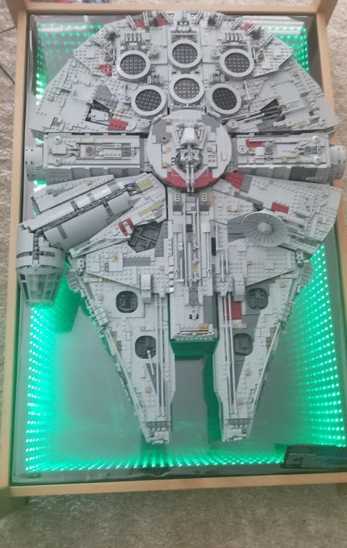
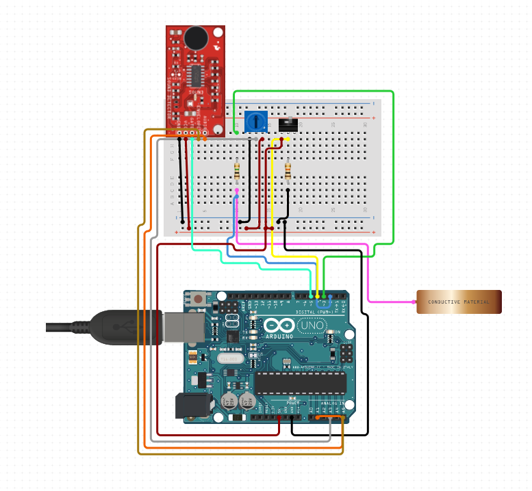

# Sound Reactive Infinity Table

This project involves:
* An Arduino
* Addressable LED RGB Strip
* Potentiometer
* Sound Detector
* Jumper Wires
* Resistors
* 25 µF Capacitor
* Toggle Switch or Slide Switch
* Table or Frame
* Smaller Frame (to fit inside of the table/frame)
* Glass
* Mirror
* Two way window film
* Power tools
* Super glue



# Schematic (Needs to be updated, do not replicate)



## Description

This project was continuation of the Sound Reactive Christmas Tree design. 
I initially wanted to create a display case for the lego millenium falcon. 
I then though about how I could make the display light up and reactive. 
At the time I didn't have a coffee table in my place so I thought why not make a table to display the millenium falcon as well as making it reactive. 
Once the table was bullt I installed an infinity mirror on the base of a coffee table that was sound reactive. 
With the use of an Arduino, the color of the LEDs would turn on when the sound sensor picked up on noise. 
LEDs would change colors when there were different frequencies.

[comment]: <> (## Getting Started)

[comment]: <> (### Dependencies)

[comment]: <> (* Describe any prerequisites, libraries, OS version, etc., needed before installing program.)

[comment]: <> (* ex. Windows 10)

[comment]: <> (### Installing)

[comment]: <> (* How/where to download your program)

[comment]: <> (* Any modifications needed to be made to files/folders)

[comment]: <> (### Executing program)

[comment]: <> (* How to run the program)

[comment]: <> (* Step-by-step bullets)

[comment]: <> (```)

[comment]: <> (code blocks for commands)

## Authors

Camille Owens


## Sources

[comment]: <> (Inspiration, code snippets, etc.)
* [sparkfun](https://www.sparkfun.com/)
